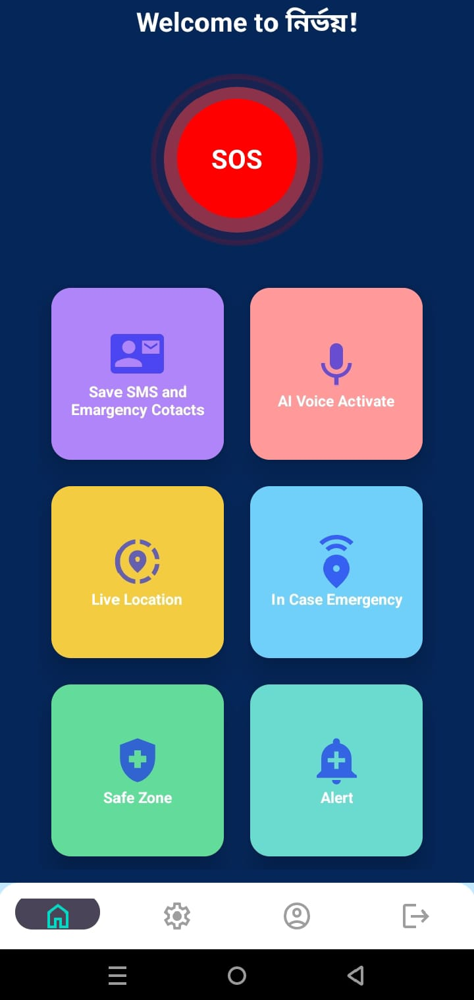
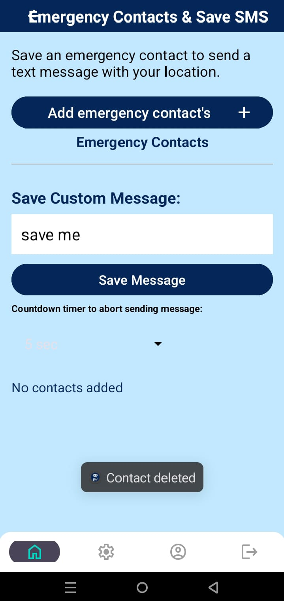
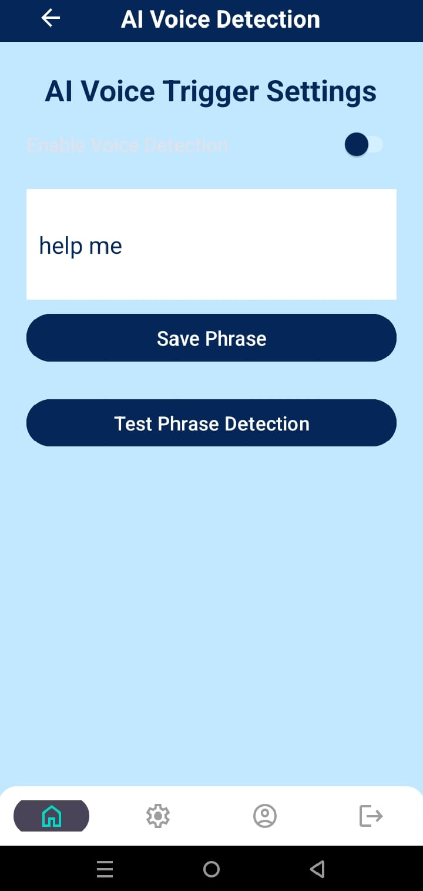
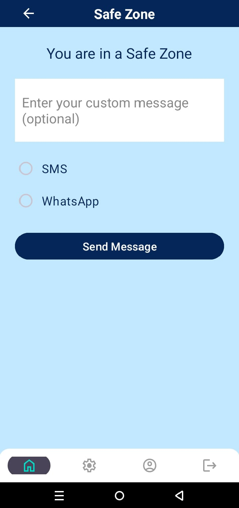
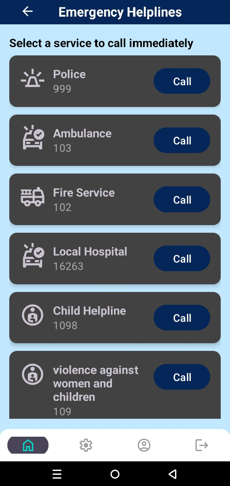
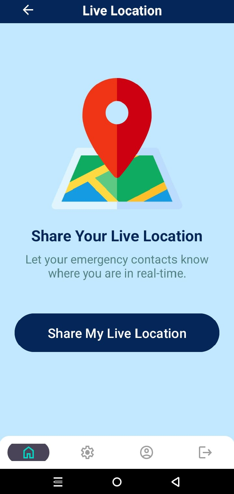

# Nirvoy - AI Powered Personal Safety App

 

Nirvoy (নির্ভয়) is an Android-based **AI-powered personal safety application** designed to help users stay safe in emergencies. It enables real-time communication with emergency contacts through SMS, WhatsApp, and Facebook, and includes smart AI-based features like voice distress detection and hardware-triggered SOS alerts.

---

## 🚨 Key Features

- ✅ **Save Emergency Contacts**  
  Add and manage trusted emergency contacts who will be notified during distress situations.

- 📝 **Save Custom Emergency Message**  
  Customize and store your own emergency message template.

- 📍 **Live Location Sharing**  
  Automatically includes your live GPS location with each emergency alert.

- 🆘 **Emergency Message Trigger**  
  - Via **SOS button** in app  
  - Via **hardware button press** (e.g., power button 3 times)  
  - Via **shake gesture detection**

- 🗣️ **AI Voice Detection**  
  Uses on-device AI to detect voice tone (fear, panic, etc.) and automatically sends alerts when distress is recognized.

- 📸 **Camera Auto-Capture (Optional)**  
  Takes a photo from the front camera in emergency situations and sends it to contacts.

- 🔕 **Hidden Decoy Mode**  
  App disguises itself to avoid suspicion while still working in the background.

- 🔐 **Safety Lock Mode**  
  Keeps your device in monitored mode with real-time behavior tracking.

---

## 🧠 AI Capabilities

- **Voice Emotion Detection**  
  Uses TensorFlow Lite to detect panic or fear in the user's voice and automatically triggers emergency responses.

- **Behavior-Based Movement Detection**  
  Analyzes abnormal or sudden shake movements to identify distress and send alerts.

---

## 📲 Screenshots

| Home | SMS and Emargency Contacts | AI Voice Activate |
|------|-------------------|--------------|
|  |  |  |

| Safe Zone | In Case Emargency | Location Sharing |
|-------------|--------------|------------------|
|  |  |  |

---

## 🛠️ Technologies Used

- **Java & XML** for Android native development  
- **Firebase** (Authentication, Realtime Database, Storage)  
- **TensorFlow Lite** for on-device voice emotion recognition  
- **Google Maps API** for location sharing  
- **Facebook SDK** for social sharing  
- **SMS & Telephony API** for emergency communication

---

## 🔐 Permissions Required

To ensure full functionality, the app requests the following permissions:

- `CAMERA`
- `ACCESS_FINE_LOCATION`
- `SEND_SMS`
- `READ_CONTACTS`
- `RECEIVE_BOOT_COMPLETED`
- `RECORD_AUDIO`
- `FOREGROUND_SERVICE`

---

## 🚀 How to Run the Project

1. Clone the repo  
   ```bash
   git clone https://github.com/razia200026/Nirvoy.git
   ```

2. Open the project in **Android Studio**

3. Add your `google-services.json` for Firebase

4. Set your Facebook App ID (for social login & sharing)

5. Run on a physical device with all permissions granted

---

## 🙌 Contribution

Feel free to fork the project, submit issues, or propose features and improvements.


---

## 💡 Acknowledgments

- OpenAI for voice processing inspiration  
- Firebase for backend support  
- TensorFlow Lite for edge AI integration  
- All contributors and testers who helped shape Nirvoy

---

> **Stay Safe. Stay Connected. Stay Nirvoy.**
